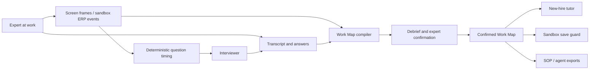

# Simon — the AI Apprentice

**Capture an expert's reasoning. Turn it into a Work Map. Teach the next person before they make the wrong call.**

A screen recording shows what someone clicked, but not why they made a decision, when the rule stops applying, or who they would ask for help. Simon learns those missing details while an expert works: it observes the screen, asks short questions at natural pauses, and turns the answers into an evidence-linked **Work Map** that the expert reviews and confirms.

The same map then guides a new hire through unfamiliar cases. In the included accounts-payable sandbox, Simon can intervene before an incorrect decision is saved and replay the expert's reasoning.

Built for the **Hack-Nation × ElevenLabs AI Apprentice challenge**. This repository is a runnable prototype with anonymous, isolated workspaces—not a compliance-reviewed production ERP. **No API keys or database are required for the local demo.**

[Live demo](https://tacit-ai-apprentice.vercel.app) · [Quick start](#quick-start-no-api-keys) · [Try the workflow](#try-the-workflow) · [Configuration](#environment-configuration) · [Dependencies](#dependencies) · [Testing](#testing-and-verification) · [Deployment](#storage-and-deployment) · [Contributing](#contributing)

Description PDF: [pdf 1 page report.pdf](https://github.com/user-attachments/files/33025050/pdf.1.page.report.pdf)


## How it works

| Stage | What you do | What Simon produces |
| --- | --- | --- |
| **Capture** | Work through cases, explain judgment calls, and answer questions at pauses. | Screen events, transcript, answers, and linked evidence. A deterministic governor controls when questions may be asked. |
| **Map** | Fill the remaining knowledge gaps, correct the teach-back, and explicitly confirm it. | A Work Map: steps, decisions, verbatim expert quotes, rules, limits, exceptions, and stop-and-ask conditions. |
| **Teach** | A new hire works through a different queue using the confirmed map. | Before-save guidance, expert evidence replay, and a record of what was mastered versus what required help. |

The map is the shared artifact, not a conversation history. The expert reviews it, a new hire learns from it, and exports can make its confirmed rules available to another agent. Simon must not invent business rules or let a model confirm its own understanding.



### What works without credentials?

| Capability | Keyless local mode | Optional provider-backed mode |
| --- | --- | --- |
| Observe work | Exact events from the included ERP (`dom`) | Screen interpretation through Vercel AI Gateway (`vision` or `both`) |
| Listen and respond | Browser speech where supported; text fallback | ElevenAgents conversations and Scribe v2 Realtime |
| Compile a map | Deterministic extraction, with limited phrasing coverage | An LLM pass through Vercel AI Gateway |
| Explore and teach | Synthetic sample maps, debrief, confirmation, tutor, and sandbox guard | The same workflow with configured providers |

Fallbacks are labeled. ERP events are not vision results, seeded examples are not a real expert session, and a passing keyless test does not verify live voice quality.

## Quick start (no API keys)

### Prerequisites

- **Node.js 22 or newer** and **npm**.
- **Git** to clone the repository.
- A current desktop **Chrome or Chromium** browser for the full screen-share/microphone workflow. Other browsers may have different speech and capture support.
- Microphone and screen-sharing permission only when capturing a live session. Use headphones for voice sessions to reduce feedback.

No Docker, database server, Supabase project, or Vercel account is needed for this local checkout.

### Install and run

```bash
git clone https://github.com/Backpacked333/sorcerer-apprentice-.git
cd sorcerer-apprentice-
npm ci
cp .env.example .env.local
```

In `.env.local`, keep provider keys, agent IDs, and Supabase credentials empty. Use these settings for the local demo:

```dotenv
NEXT_PUBLIC_EVENT_SOURCE=dom
STORAGE_BACKEND=local
STORE_OWNER_ID=local
```

Then create the sample sessions and start the app:

```bash
npm run seed:session -- --if-missing
npm run dev
```

Open **http://localhost:3000**. The landing page offers a sample Work Map, the capture workflow, and the tutor. On a fresh workspace, **Load the sample Work Map** creates a scripted example without overwriting your captures or ERP state.

`STORE_OWNER_ID=local` lets the local browser see the workspace used by the seed script; keep it together with `STORAGE_BACKEND=local`. This shared local rehearsal mode is different from the cookie-isolated deployed experience.

> PowerShell: use `Copy-Item .env.example .env.local` instead of `cp`. The application can run on Windows, but the repository's smoke script requires Linux/macOS (or WSL).

The samples are synthetic and deliberately separate from live capture. `--if-missing` preserves existing sample sessions. Running **`npm run seed:session` without that flag resets the demo sessions, ERP queues, and teach guard**; use it only when you intend to reset the demo.

## Try the workflow

### 1. Explore a sample

- `/map/demo_sabine` opens the seeded map with gaps to resolve during debrief.
- `/map/demo_sabine_confirmed` opens the expert-confirmed sample.
- `/teach?from=demo_sabine_confirmed` starts a tutor session from that sample.

The demo ERP is titled **MB-ERP · Accounts payable**, with posting period **12/2025**. These are scenario details, not required business rules for the product.

### 2. Capture your own session

1. Open `/capture`. The ERP and Simon share one workspace.
2. Give consent, start capture, and select the current tab in the browser's sharing dialog.
3. Work the expert queue. Explain why you make a judgment call; pause naturally for questions.
4. Choose **Done · start the debrief**. Fill the remaining slots, correct the teach-back, and confirm the map.
5. Open Teach and try a new-hire case using the confirmed map.

For a telemetry-only run, use `/capture?share=0` with `NEXT_PUBLIC_EVENT_SOURCE=dom`. This skips screen sharing; it does not test visual interpretation. You can also use `/capture?layout=companion` and **Open the ERP window** for a two-window layout. Both windows must use the **same origin**—scheme, host, and port.

### Route guide

| Route | Purpose |
| --- | --- |
| `/` | Landing page and sample entry points |
| `/capture` | Expert capture workspace |
| `/map` / `/map/<sessionId>` | Map entry point / a session's Work Map and debrief |
| `/teach` / `/teach?from=<confirmedMapId>` | Tutor entry point / start from a confirmed map |
| `/erp` | Expert accounts-payable queue |
| `/erp?queue=newhire` | New-hire queue |
| `/erp?queue=autopilot` | Agent-demo queue |
| `/demo` | Presenter controls and sandbox reset; use the seed command to restore samples |
| `/voice-check` / `/voice-check?role=tutor` | Interviewer / tutor connection diagnostics |
| `/api/health` | Storage reachability and provider configuration presence; not an end-to-end provider check |
| `/claims` | Claims workbench sandbox (vision only, no ERP telemetry); capture it with `/capture?app=claims` |
| `/platform` | Platform pages built from real captured sessions (roles, sessions) |
| `/demo/companion` / `/platform/demo` | Demo mode with fictional data (see below) |

### Where to look (the Apprentice Test)

| Question | Where to look |
| --- | --- |
| When to ask | The companion's glow, and the Governor under Show the mechanism. Timing is code, not a prompt. |
| What to ask | Candidate questions, under Show the mechanism. It never asks what the screen already shows. |
| When it has understood | Gaps closed, on the map. Only the expert's words fill a slot, and only an explicit yes locks it. |
| Whether the new hire learned | The mastery card. Rescued and learned are different labels. |
| Trust | Struck from the record, and the Privacy ledger. In the workspace, masks are painted before a frame leaves the browser. |

### Product tour / Demo mode

- `/` is the landing page: an animated hero labelled "Illustration" (generic beats, no business rules), the two doors (a finished sample Work Map and tutor, or a live capture), the Apprentice Test and honest limits. The status strip reads `/api/health` and the event source; it reports provider configuration, never a live provider check.
- `/demo` is the presenter room: reset, launch links, cue card.
- `/demo/companion` is **demo mode**: every companion state (13 moods, the capsule, ask, teach-back and teach layouts) plus a "Play states" scripted tour over a fake support console. All copy is fictional (Larkspur Telecom, fictional), labelled as demo data, and never imported by the live product. Under reduced motion, Play jumps to the end state.
- `/platform/demo` shows the platform pages with a fictional company. Everything outside demo mode runs on real session data only.

Screenshots in the submission are taken from these routes.

## Environment configuration

### Configuration files

| File | Purpose | Commit it? |
| --- | --- | --- |
| [`.env.example`](.env.example) | Environment template with empty credential fields and example values | Yes |
| `.env.local` | Your local settings and secrets | **No**; ignored |
| `.env`, `.env.*` | Optional Next.js environment-specific settings | No; this repository ignores these except `.env.example` |
| [`package.json`](package.json) / [`package-lock.json`](package-lock.json) | Scripts, direct dependencies, and reproducible dependency resolution | Yes |
| [`supabase/migrations/`](supabase/migrations/) | Versioned SQL for durable workspaces and private media storage | Yes |
| [`next.config.ts`](next.config.ts), [`tsconfig.json`](tsconfig.json), [`postcss.config.mjs`](postcss.config.mjs) | Framework, TypeScript, and Tailwind/PostCSS configuration | Yes |

Next.js loads environment files from the repository root. `scripts/create-agents.ts` separately loads `.env.local` and `.env`; the standalone seed script does **not** load them. If you customize `DATA_DIR`, `STORE_OWNER_ID`, or the storage backend, export the same values to the seed process as well as configuring them for the app. The default keyless setup above uses the same `local` owner and `.data` location in both processes.

**Never put secrets in a `NEXT_PUBLIC_*` variable.** Those values may be exposed to the browser and embedded during `next build`. Restart development after changing configuration; rebuild production when public configuration changes. Shell/hosting environment values can take precedence over local files.

### Providers and storage

All provider settings are optional for keyless mode. Defaults below describe the current implementation, not just the labels in the template.

| Variable | Default / example | Used for |
| --- | --- | --- |
| `ELEVENLABS_API_KEY` | Empty | Server-side Scribe token issuance and agent administration |
| `NEXT_PUBLIC_INTERVIEWER_AGENT_ID` | Empty | Interviewer used by Capture and Map |
| `NEXT_PUBLIC_TUTOR_AGENT_ID` | Empty | Tutor used by Teach |
| `ELEVENLABS_VOICE_ID` | Provider default if omitted | Optional voice ID applied by `agents:create` |
| `AGENT_LLM` | `gemini-2.5-flash` | Conversational model applied by `agents:create`; optional, not listed in the template |
| `AI_GATEWAY_API_KEY` | Empty | Server-side vision and LLM compilation; Vercel OIDC is also supported |
| `VISION_MODEL` | `anthropic/claude-haiku-4.5` | Gateway model for screen interpretation |
| `COMPILE_MODEL` | `anthropic/claude-sonnet-4.5` | Gateway model for the compiler's optional LLM pass |
| `NEXT_PUBLIC_EVENT_SOURCE` | `both` | `dom`: ERP only; `vision`: frames only; `both`: vision plus delayed ERP fallback |
| `STORAGE_BACKEND` | Template: `local` | `local` filesystem or `supabase`; Vercel always requires Supabase |
| `SUPABASE_URL` | Empty | Supabase project API URL; required for durable hosting |
| `SUPABASE_SERVICE_ROLE_KEY` | Empty | **Server-only** service-role credential; never expose to the browser |
| `SUPABASE_STORAGE_BUCKET` | `tacit-media` | Private evidence bucket; the migrations create the default bucket |
| `STORE_OWNER_ID` | Template: `local` | Local/script workspace; with an explicit local backend, lets browser requests use the seeded workspace outside Vercel |
| `DATA_DIR` | `.data` under the working directory | Local storage root for workspace-scoped sessions, maps, ERP state, guards, and media |
| `PORT` | `3000` in `start:prod` | Production listener port |
| `ELEVENLABS_PRIVATE_AGENTS` | Template: `1` | **Health-reporting flag only.** Does not enable authenticated agents in the current implementation |
| `ELEVENLABS_TTS_MODEL` | `eleven_v4_turbo` | Agent provisioning enforces this exact model and rejects other values; health only reports the configured label |

> **Agent authentication limitation:** the current agent script sets `enableAuth: false`, and there is no implemented `/api/agent-token` route. Setting `ELEVENLABS_PRIVATE_AGENTS=1` does not make agents private. The script does enforce `eleven_v4_turbo` on the wire and checks the saved remote configuration; `/api/health` alone proves neither the voice model nor agent authentication. Review the script before updating agents whose existing settings you need to preserve.

### Optional ElevenLabs setup

1. Add `ELEVENLABS_API_KEY` to `.env.local`. Set `ELEVENLABS_VOICE_ID` and `AGENT_LLM` if needed.
2. Review [`scripts/create-agents.ts`](scripts/create-agents.ts), [`agents/interviewer.md`](agents/interviewer.md), [`agents/tutor.md`](agents/tutor.md), and [`agents/tools.json`](agents/tools.json).
3. If agents already exist, set their IDs and inspect remote configuration without changing it:

   ```bash
   npm run agents:create -- --check
   ```

4. When you intend to **create or update remote agents and shared client tools**, run:

   ```bash
   npm run agents:create
   ```

   The script reuses configured IDs or resolves agents by their existing names. Copy the printed interviewer and tutor IDs into `.env.local`, then restart the app. `--force-new` intentionally creates fresh agents; it is not the normal setup path.
5. Run `npm run agents:create -- --check` again to verify the saved V4 model, voice-flow settings, and prompt consistency. Use `/voice-check` for a connection diagnostic, then verify real Capture, Map, and Teach sessions. A diagnostic connection alone does not validate those workflows.

Use dedicated agents for this app. Each tutor conversation receives only its current confirmed Work Map; the confirmation route does **not** attach visitor maps to a shared agent knowledge base.

Provider requests can incur charges. Review the account's recording and retention settings: the script requests `recordVoice=false` and seven-day retention, but can retry without unsupported privacy settings. Its output must be checked; successful provisioning does not guarantee that both settings were applied. Browser speech is a fallback, not equivalent proof of an ElevenLabs session.

### Optional vision and LLM compilation

Set `AI_GATEWAY_API_KEY` in `.env.local`, choose available Gateway model slugs if overriding the defaults, and set `NEXT_PUBLIC_EVENT_SOURCE=both` or `vision`. Restart the app, grant screen-sharing permission, and start capture.

On Vercel, an enabled AI Gateway can authenticate via Vercel OIDC instead of a static key; local development normally uses the key. Without either credential, use `dom`: the vision route returns a labeled unavailable/degraded response and the compiler keeps its deterministic path. Model availability, quota, permissions, and real response quality require a live check in your account.

<details>
<summary><strong>Advanced tuning and diagnostic variables</strong></summary>

The governor uses deterministic gates rather than prompt-only timing. These values come from `.env.example`; keep the defaults until you can evaluate actual question timing. Time values are in seconds; counts and scores are noted separately. See [`lib/capture-config.ts`](lib/capture-config.ts) and [`lib/governor.ts`](lib/governor.ts).

| Variable | Template value | Meaning |
| --- | --- | --- |
| `NEXT_PUBLIC_SILENCE_SECS` | `2.5` | Silence before a question may open |
| `NEXT_PUBLIC_STILL_SECS` | `2` | Screen stillness requirement |
| `NEXT_PUBLIC_COOLDOWN_SECS` | `20` | Spacing between question windows |
| `NEXT_PUBLIC_MAX_QUESTIONS_PER_10MIN` | `5` | Question budget (count) |
| `NEXT_PUBLIC_WARMUP_SECS` | `8` | Initial quiet observation period |
| `NEXT_PUBLIC_READING_SECS` | `5` | Reading grace period |
| `NEXT_PUBLIC_TYPING_QUIET_SECS` | `3` | Quiet interval after typing |
| `NEXT_PUBLIC_WINDOW_TIMEOUT_SECS` | `20` | Question-window timeout |
| `NEXT_PUBLIC_MIN_VALUE` | `0.6` | Minimum candidate-value score |
| `NEXT_PUBLIC_GRACE_SECS` | `18` | Follow-up grace period |
| `NEXT_PUBLIC_MAX_CHAINED` | `2` | Maximum chained questions (count) |

Additional optional settings not in the template:

- `NEXT_PUBLIC_SCRIBE_FILTER_BG`: background-audio filtering is enabled unless set to `0`.
- `NEXT_PUBLIC_COMPILE_LABEL`: display label for the LLM compile pass; does not select a model.
- `CHROME_PATH`: custom browser executable for screenshot/smoke scripts.
- `OUT`: screenshot output directory (smoke default: `/tmp/tacit-shots`).
- `BASE`: origin for `scripts/d-shots.mjs`; the smoke script instead uses fixed port `3077`.
- `VERCEL_OIDC_TOKEN`: Vercel-managed Gateway authentication, also read by `@vercel/oidc`.
- `VERCEL`: hosting detection; when set, storage requires Supabase and browser workspaces remain cookie-scoped.
- `VERCEL_GIT_COMMIT_SHA` / `COMMIT_SHA` / `RAILWAY_GIT_COMMIT_SHA`: revision metadata reported by health.

</details>

## Dependencies

[`package.json`](package.json) defines the supported ranges below. [`package-lock.json`](package-lock.json) records exact installed versions and transitive dependencies; use **`npm ci`** for a reproducible installation.

| Package | Declared range | Purpose |
| --- | --- | --- |
| `next` | `^16.3.8` | App Router UI, server rendering, and API routes |
| `react`, `react-dom` | `^19.2.0` | Client and server UI |
| `@elevenlabs/react` | `^1.16.0` | Browser voice and transcription integration |
| `@elevenlabs/elevenlabs-js` | `^2.70.0` | Server-side ElevenLabs SDK |
| `ai` | `^7.0.127` | Model invocation and structured output |
| `@ai-sdk/gateway` | `^4.0.103` | Vercel AI Gateway integration |
| `@supabase/supabase-js` | `^2.117.2` | Server-side durable data and private evidence storage |
| `@vercel/oidc` | `3.2.0` | Vercel identity token access for Gateway configuration |
| `zod` | `^4.6.5` | Runtime schemas and validation |
| `tsx` | `^4` | TypeScript scripts; needed at runtime by production seeding |
| `typescript` | `^5` | Static type checking |
| `tailwindcss`, `@tailwindcss/postcss` | `^4.3.3` | Styling and CSS build pipeline |
| `vitest` | `^5.0.3` | Automated tests |
| `playwright` | `^1.63.0` | Browser smoke and screenshot scripts |
| `@types/node` | `^22` | Node.js type definitions |
| `@types/react`, `@types/react-dom` | `^19` | React type definitions |

Local keyless development uses the filesystem backend. Durable deployment needs a Supabase project; real voice and vision/LLM paths need their respective provider accounts. The Supabase and Vercel CLIs are optional deployment tools, not project dependencies.

## Commands

| Command | Purpose |
| --- | --- |
| `npm ci` | Install exactly from the lockfile |
| `npm run dev` | Development server on port 3000; append `-- -p <port>` to choose another |
| `npm run build` | Production build |
| `npm start` | Serve an existing production build; does not seed samples |
| `npm run start:prod` | Seed missing samples, then serve on `PORT` or 3000 (POSIX shell syntax) |
| `npm run typecheck` | TypeScript checks without emitting code |
| `npm test` | Run the Vitest suite once |
| `npm run test:watch` | Vitest watch mode |
| `npm run smoke` | Isolated keyless production build and browser smoke test |
| `npm run seed:session -- --if-missing` | Create missing samples without resetting existing demo state |
| `npm run seed:session` | Reset the demo sessions, ERP queues, and teach guard |
| `npm run agents:create -- --check` | Read remote agent configuration without mutation; needs credentials |
| `npm run agents:create` | Create/update remote agents and tools; needs credentials |

There is currently **no lint script or configured linter**. Type checking is not a substitute for linting; do not expect `npm run lint` to work.

## Testing and verification

Run the repository checks before submitting a change:

```bash
npm run typecheck
npm test
npm run build
```

CI runs dependency installation, type checking, tests, and a production build; see [`.github/workflows/ci.yml`](.github/workflows/ci.yml). The suite covers compiler evidence and corpus cases, map confirmation, rule matching, timing/protocol logic, ERP guards, and other contracts without requiring provider credentials.

For the optional browser smoke gate on Linux/macOS or WSL:

```bash
npx playwright install chromium --only-shell
npm run smoke
```

The script copies the project to an isolated temporary directory, excludes local environment/data files, clears provider credentials, builds production, seeds its own data, and starts **port 3077**. Do not start a server on that port first. It blocks external browser requests and tests the text-only fallback, not real microphone/audio behavior. Screenshots go to `OUT` or `/tmp/tacit-shots`.

Live ElevenLabs/Gateway execution, microphone acoustics, natural interruption timing, and perceived voice quality need separate provider-backed and human verification. Unit tests, sample data, and the smoke gate do not establish those claims.

## Storage and deployment

All persistence goes through [`lib/store.ts`](lib/store.ts), including ERP state and teach guards. It supports two backends:

| Backend | Intended use | Data location |
| --- | --- | --- |
| `local` | Keyless development or one persistent Node.js instance | Workspace-scoped files under `DATA_DIR` |
| `supabase` | Durable hosting, including Vercel | PostgreSQL records and private Storage objects |

Without an explicit backend, complete Supabase credentials select Supabase; otherwise local files are used. A partial credential pair is an error. **On Vercel, Supabase is always required**, even if `STORAGE_BACKEND=local` is set. Missing or broken durable storage fails closed instead of falling back to ephemeral files.

### Anonymous workspaces

[`proxy.ts`](proxy.ts) issues an unguessable HttpOnly `tacit_ws` cookie. Session, map, media, ERP, and guard access is scoped to that workspace. This is **browser isolation, not accounts or cross-device recovery**: losing the cookie loses access to that workspace. Local `STORAGE_BACKEND=local` plus `STORE_OWNER_ID=local` deliberately shares the seeded workspace for rehearsal; it does not override Vercel's browser isolation.

### Supabase + Vercel

1. **Create a dedicated Supabase project.** Apply every SQL file in [`supabase/migrations/`](supabase/migrations/) in filename order, using the SQL editor or `supabase db push` after linking the intended project. Both the durable-workspace and store-contract migrations are required. They create workspace-scoped tables, atomic update functions, and the private `tacit-media` bucket. RLS is enabled and direct anon/authenticated table access is revoked; the server uses the service-role key. No Supabase Auth setup is required.
2. **Configure Vercel's Next.js project.** Set `STORAGE_BACKEND=supabase`, `SUPABASE_URL`, and `SUPABASE_SERVICE_ROLE_KEY` for the intended environment. Keep the default private bucket or provision an equivalent bucket before overriding `SUPABASE_STORAGE_BUCKET`. Media is served through workspace-checked application routes, not public bucket URLs. Use separate non-production resources for Preview when possible.
3. **Configure optional providers.** Set the Gateway key or enable OIDC-backed Gateway access, model slugs, and `NEXT_PUBLIC_EVENT_SOURCE=both` (or `vision`). Provision ElevenLabs agents as described above and set their IDs **before building**. Review the agent-authentication limitation before making voice available publicly. Never put a service-role key or provider secret in a `NEXT_PUBLIC_*` setting.
4. **Verify, then deploy through your approved process.** Run the [repository checks](#testing-and-verification) and use Vercel's Next.js preset with `npm run build`. Do not use the local `start:prod` seeding wrapper as a Vercel build command. A fresh deployed browser can load its own sample from the landing page; local `.data` is not uploaded.
5. **Check the deployed behavior.** `/api/health` returns 200 only when its storage read succeeds, otherwise 503. Provider fields report configuration presence, not live calls. Check two fresh browser contexts for isolation, create a session and evidence, and confirm persistence across reloads and a new deployment. Validate live voice, vision, and compilation separately.

If you use the Vercel CLI for local configuration, link the correct project before running `vercel env pull .env.local`. That command can replace local settings; preserve any local-only overrides and never commit the downloaded secrets. OIDC tokens expire, so refresh local credentials when authentication fails.

### Local production-style rehearsal

With the keyless `.env.local` settings above:

```bash
npm run build
npm run start:prod
```

`start:prod` seeds only missing samples and starts on `PORT` or 3000. Its seed process still needs explicit environment variables if you use anything other than the default local/script workspace. For filesystem hosting, use **one long-running Node.js process and a writable persistent volume** for `DATA_DIR`; do not rely on local files across serverless invocations or replicas. Use HTTPS for remote microphone and screen access.

Do not commit `.data`, environment secrets, captured media, or local recordings. Use synthetic data for public demos; this prototype is not a compliance-reviewed system for sensitive business records.

## Privacy and current limits

- **Source honesty:** vision events and ERP telemetry remain distinct (`seen` versus `erp`). `dom` cannot observe arbitrary third-party applications.
- **Evidence, not invention:** quotes must remain the expert's own words. Unknown conditions stay open instead of being guessed. Deterministic extraction has narrower language coverage than a verified LLM-backed flow.
- **Explicit confirmation:** only expert-confirmed maps may drive Teach and executable exports.
- **Screen privacy:** the app provides consent, masking, and off-the-record controls. Validate the selected capture surface and masks before sharing sensitive material.
- **Provider retention:** removing or striking evidence in the app is not a guarantee of deletion from a provider's conversation history or backups. Review provider policies; do not claim zero retention.
- **Before-save protection:** the included ERP has an application-integrated save guard. On an unrelated third-party application, guidance is only a warning unless an authorized integration can block the action.
- **Prototype boundaries:** anonymous cookie isolation is not account authentication; local rehearsal mode shares one workspace. Public-agent configuration and synthetic demos are not production security guarantees.
- **Acceptance still requires people:** run a real expert task, answer at least three live questions and three distinct debrief follow-ups, inspect the evidence, explicitly confirm, then have a second person attempt an unseen wrong decision. Verify that the tutor intervenes before save and quotes the expert accurately. Automated checks alone cannot prove this.

## Troubleshooting

| Symptom | What to check |
| --- | --- |
| No sample map on the landing page | Use **Load the sample Work Map**, or run the seed command locally. For local seeded routes, use `STORAGE_BACKEND=local` and `STORE_OWNER_ID=local` in the app and the same owner/data location in the seed process. |
| Health returns 503 / storage unavailable | Check both Supabase credentials, apply all migrations, and check database access. Vercel never falls back to local files. |
| Vision is unavailable without a key | Set `NEXT_PUBLIC_EVENT_SOURCE=dom` and restart, or configure `AI_GATEWAY_API_KEY` for real vision. |
| No microphone or screen-share prompt | Use desktop Chrome/Chromium on localhost or HTTPS; check browser and OS permissions. `?share=0` deliberately skips sharing. |
| Browser speech is unavailable | Use the text fallback or configure ElevenLabs. Browser speech support varies; a fallback is not a provider failure report. |
| ElevenLabs is configured but silent | Check the correct agent IDs, account access/quota, permissions, and `/voice-check`. Inspect saved remote configuration with `agents:create -- --check`; health labels alone are insufficient. |
| Events do not reach Simon from a separate ERP window | Use the same scheme, host, and port in both windows. Avoid mixing `localhost`, `127.0.0.1`, and a tunnel/deployment URL. |
| Teach refuses a map | Complete the debrief and expert confirmation, or use the confirmed sample. Do not bypass the confirmation gate. |
| Smoke reports a missing browser | Install Playwright Chromium with the command above, or set `CHROME_PATH` to a compatible executable. |
| Smoke reports port 3077 occupied | Stop the known process using that port, then rerun. The smoke script manages its own server. |
| Environment changes have no effect | Check exported process values, restart development, and rebuild production for changed public settings. Standalone seeding does not load `.env.local`. |

## Repository guide

```text
agents/             Interviewer/tutor prompts and client-tool schemas
app/                Next.js pages and API routes
components/         Capture, Map, Teach, voice, ERP, and shared UI
lib/                Compiler, Work Map, governor, matcher, storage, and tests
scripts/            Seeding, remote agent administration, smoke, screenshots
docs/               Product spec, lane plans, contracts, platform research, demo references
supabase/migrations/ Durable workspace tables, functions, and private media bucket
public/             Brand and presentation assets
.github/workflows/  Continuous integration
.env.example        Environment template (no credentials)
```

Start with the [documentation index](docs/00-START-HERE.md). The [product specification](docs/01-SPEC.md), [interface contracts](docs/03-CONTRACTS.md), and [demo guide](docs/05-DEMO-AND-SUBMISSION.md) provide deeper context. The specification and platform research also contain historical proposals; this README describes the current checkout.

**Naming:** the product is Simon. Some package names, script output, seeded IDs, and infrastructure identifiers retain the earlier name `tacit` for compatibility.

## Contributing

Read [AGENTS.md](AGENTS.md), the [team protocol](docs/04-TEAM-PROTOCOL.md), and your [lane plan](docs/lanes/) before editing. Follow the existing ownership and coordination rules. Keep changes focused, preserve keyless operation, document configuration changes, and report exactly what you tested. Never commit secrets or silently change remote agents as part of local setup.

## License

Distributed under the [MIT License](LICENSE).

**People first, then agents, then a living memory.**
