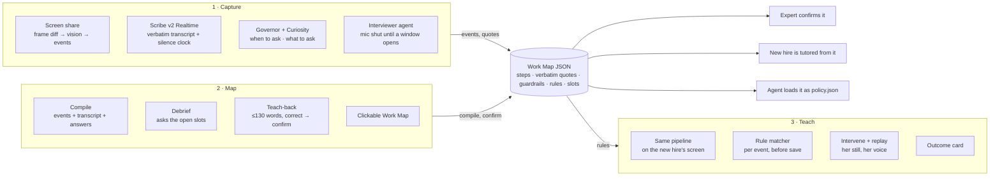
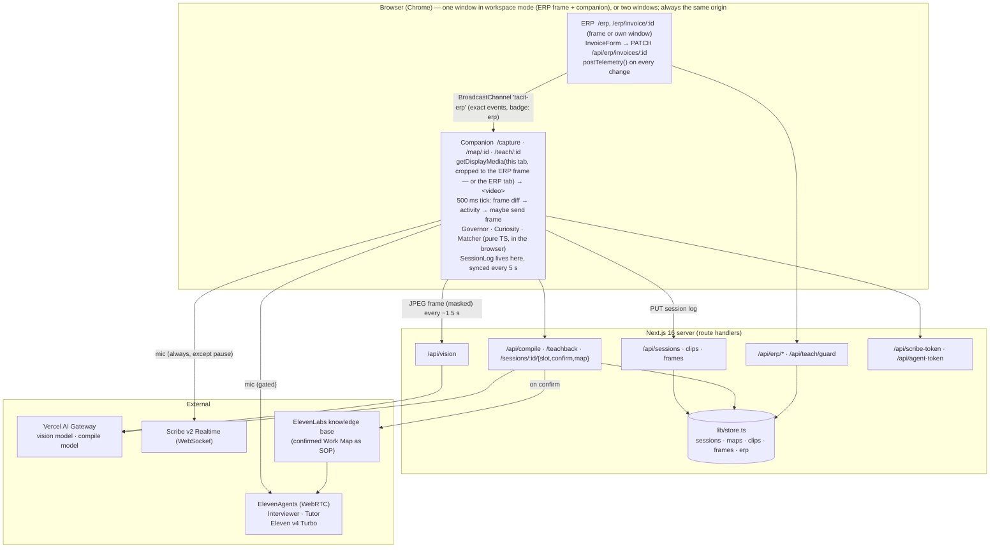
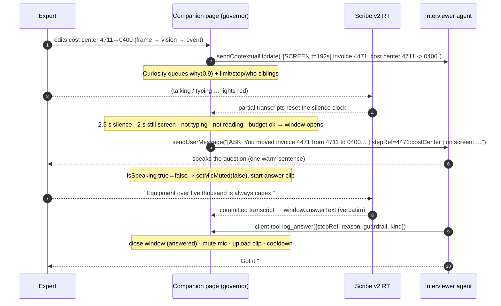
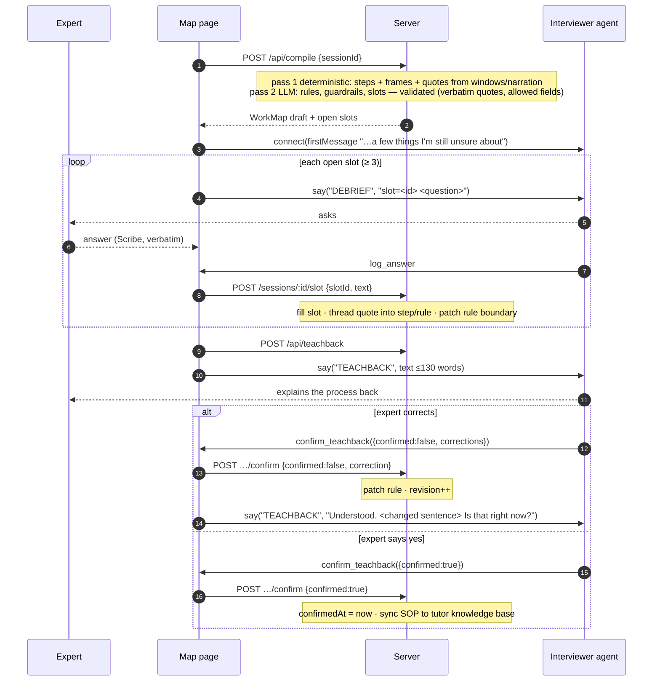

# 01 · Tacit — the AI Apprentice · Master Spec

> **Hack-Nation 7th Global AI Hackathon · Challenge 01 "The AI Apprentice" · powered by ElevenLabs**
> Team of four. Submission closes **Sunday Oct 4, 2026, 9:00 AM ET**. We submit at 7:30 AM. Feature freeze 3:30 AM.
> This is the single source of truth for *what* we are building and *how it works*. Who does what: `04-TEAM-PROTOCOL.md` and `lanes/`. The interfaces: `03-CONTRACTS.md`. The show: `05-DEMO-AND-SUBMISSION.md`.

**Precedence when documents disagree:** the challenge brief (§2) → this spec → the lane docs → earlier research (the 19-hour plan, the engineering playbook, the V3 submission contract — all folded in here; do not go back to them). Code on `main` beats any doc about what *is*; this spec beats code about what *should be*.

---

## 1. The product in one page

**The problem.** Experienced people are retiring and what makes them good was never written down. Screen recordings show *what* was clicked, never *why*; guardrails — limits, exceptions, the moment to stop and ask — are invisible until a new hire breaks one.

**The product.** *Tacit* is an apprentice, not a recorder. It sits next to an expert while they do a real desk task, watches the screen, stays quiet while they type, read or talk, and at natural pauses asks one short spoken question about what just happened on screen: *why this, where's the limit, when would you stop and ask someone.* When the task ends it runs a short spoken debrief on exactly the things it still does not know, then explains the whole process back until the expert says "yes, that's how it works." The result is a **Work Map**: a clickable timeline where every step shows the screen moment, the decision, the reason in the expert's own words, and the guardrails around it. That same map then becomes a **voice tutor** that watches a new hire's screen, steps in *before* a wrong decision is saved, explains it with the expert's reasoning, replays her screen moment, and reports what was learned.

**The thesis (this is what differentiates us).** *An apprentice is a slot-filling machine.* Treat the workflow as rules with empty slots — **reason, limit, exception, who to ask**. Use the screen to detect that a judgment call just happened. Use voice only at the moment a slot can be filled. Declare understanding only when every slot is filled *and* the expert confirms the teach-back. Then run the same rules against the new hire's screen. Most teams will ship a voice agent bolted onto a screen recording; we ship a knowledge model with voice as its input channel.

**One artifact, three readers.** The Work Map is the only state that crosses module boundaries:

- the **expert** reads it as a timeline and confirms it;
- the **new hire** is tutored from it;
- an **agent** loads it as guardrails (`policy.json`) — which is the moonshot, and falls out of the architecture for free.

**Three modules, one pipeline.**

**Use case.** The brief's running example, verbatim: three supplier invoices in a sandbox ERP — one over the €5,000 capex line, one from a subsidiary needing a second approval, one from a supplier that double-bills in December. We do not "outgrow" this example; it is the bar the judges will measure against. We win on natural conversation, faithful explanations, evidence you can click, and a tutor that actually catches the mistake.

---

## 2. The brief, distilled (source of truth)

**Build all three modules.**

| Module | What the brief says | **Required** box |
|---|---|---|
| **1 Capture** | Web app; expert shares screen; ElevenLabs agent listens in a side panel. A frame every 1–2 s goes to a vision model and becomes events ("invoice 4471 opened", "cost center 4711 → 0400"). Agent stays quiet while the expert types, reads or talks; asks at natural pauses. | During a real task the agent asks **≥ 3 questions**, each **at a natural pause** and **about something visible on screen**; **≥ 1 about a guardrail**. |
| **2 Map** | Short spoken debrief asks what is still unclear, then explains the whole process back so the expert can confirm or correct. Output: Work Map — clickable timeline; each step shows screen moment, decision, reason in the expert's words, guardrails. | Debrief asks **≥ 3 follow-ups not answered during the task**, ends with a **teach-back the expert confirms**. **Every step and guardrail links to a screen moment and the expert's own words.** |
| **3 Teach** | Work Map → voice tutor. New hire works a case on their own screen; tutor watches, explains each step the way the expert did, asks them to predict the next decision, steps in before a guardrail is broken, replays the expert's screen moment; ends with mastered / practice next. | A judge playing a new hire processes **a case the expert never showed**. Tutor catches **≥ 1 wrong decision before it is saved** and explains it **using the reasoning the expert gave**. |

**The Apprentice Test — the demo must answer five questions:** (1) **When to ask** — how does it know the expert paused, and stay quiet while they type, read or talk? (2) **What to ask** — how does it pick a question that reveals a reason or guardrail instead of one the screen already answers? (3) **When it has understood** — how does the debrief decide it is done, and how does the teach-back prove it? (4) **Whether the new hire learned** — how do you show they can handle a new case on their own? (5) **Trust** — how can the expert take something off the record, and how is personal data on screen protected?

**Strong vs weak (their table):** asks at natural pauses about what is on screen *(vs interrupts mid-typing, generic questions)* · captures guardrails *(vs happy path only)* · debrief closes gaps and ends with a teach-back *(vs a transcript summary)* · tutor teaches a new hire to decide, in the expert's words *(vs a screen recording nobody watches)* · a pitch with a clear moonshot *(vs a demo that stops at the demo)*.

**Built with ElevenLabs — "the voice agent is the product, so it has to feel like a thoughtful colleague":** ElevenAgents plays both roles (interviewer, tutor) with **Expressive Mode**; our choice of LLM; **Scribe v2 Realtime** listens while people work and knows when they pause. Suggested wiring: frames → vision → events; push events into the agent conversation; LLM merges events + transcript + answers into Work Map JSON and lists what is unclear; Work Map goes into the tutor's knowledge base. Tips: *start with voice and one screen; ask less, later — three to five live questions per ten minutes, the rest waits for the debrief.*

**Stretch (official):** two experts one task (diff and ask each why) · any language (expert German → tutor English) · agent-ready guardrails (export the Work Map as instructions an agent can load). **Moonshot:** end the pitch with one slide.

**What is illustrative, not mandatory:** the example's seven steps / three judgment calls / four guardrails, the €5,000 threshold, the €7,200 invoice. The minimums that *are* mandatory: 3 live questions (1 guardrail), 3 new debrief follow-ups, a confirmed teach-back, evidence links on every step and guardrail, one pre-save catch on an unseen case.

---

## 3. Who uses it, and what they see

| Persona | Surface | What they see | What they never see |
|---|---|---|---|
| **Sabine**, the expert | The ERP she works in + a narrow **companion** panel (`/capture`) | Session state (watching · waiting for a pause · asking · listening · off record), **one** current question, live captions, a privacy ledger, three controls: *Not now* · *Scratch that* · *Hold to pause* · *Done* | Settings, diagnostics, scores. (A "show the mechanism" toggle reveals the event feed and candidate queue for judges.) |
| Sabine, after the task | `/map/<session>` | Understanding bar (filled slots / total), the debrief question being asked, the teach-back text, then the Work Map timeline she can click, correct, and confirm | A wall of JSON |
| **Lena**, the new hire | The ERP + the **tutor** panel (`/teach/<session>`) | What the tutor just said, the replay panel (Sabine's still + her words + her voice), rules in play, and at the end an outcome card | The answer before she has tried |
| A **judge** | All of the above, driven by them | The five Apprentice Test mechanisms, each visible on screen | Anything that only works when we drive |

**Layout.** Default is **workspace mode**: one browser window, the work application (our sandbox ERP, in a same-origin frame) on the left, the Tacit companion as a ~420 px side panel on the right — the brief's literal "agent listens in a side panel". The expert shares "this tab"; the capture is cropped to the ERP region, so the vision model never sees the companion. It keeps the lights, the question and the controls in view while they work, avoids background-tab throttling, and is what a juror gets on the live link. **Two-window mode** (any application in its own window, the companion beside it) is the general path and stays supported.

Interface principle: the work application stays dominant; the apprentice is a quiet companion. Honest states, no fake confidence meters. Concrete coverage ("2 decisions explained · 3 questions open") instead of percentages wherever possible.

---

## 4. Requirements and acceptance (the IDs every PR must cite)

"Lane" = who owns making it true; several lanes may contribute.

### Core (from the brief — none of these may be cut)

| ID | Requirement | Observable acceptance (a stranger drives, real keys, deployed URL) | Lanes |
|---|---|---|---|
| **C1** | Expert shares screen; ElevenLabs agent listens | Real browser permissions, a live ElevenAgents session, a real captured surface | A, B |
| **C2** | Frames every 1–2 s → vision model → events | Event feed shows `seen` events for every decision on the three invoices, correct from/to values, ≤ ~2 s after the change, ≥ 9 runs in 10; dropped frames are counted and shown, never silently hidden | B |
| **C3** | ≥ 3 live questions at natural pauses about something on screen; ≥ 1 guardrail | Session log has ≥ 3 answered windows in a 5–7 min run; each `question` names the invoice and the change; ≥ 1 window with `kind ∈ {limit, stop, who, counterfactual}`; `interruptionsWhileTyping == 0`; a human reviewer agrees each landed at a pause | A |
| **M1** | Spoken debrief asks ≥ 3 follow-ups not answered during the task | ≥ 3 `[DEBRIEF]` questions spoken; none duplicates a slot already filled live or by narration | C, A |
| **M2** | Teach-back; expert confirms or corrects | Spoken teach-back ≤ 60 s; a spoken correction changes the rule and only the changed sentence is re-read; `confirmedAt` set only by an explicit yes bound to the current revision | C, A |
| **M3** | Clickable Work Map: step → screen moment, decision, reason in her words, guardrails | Opening any judgment step or guardrail shows a stored frame **and** a verbatim quote; nothing orphaned; described-but-not-demonstrated exceptions are labeled | C, D, B |
| **T1** | Tutor watches the new hire's own screen, explains, asks for predictions, replays evidence | A separate teach session with fresh events from Lena's screen, driven by the confirmed map (no re-entered policy) | C, A, B |
| **T2** | Unseen case; ≥ 1 wrong decision caught **before save**, explained with the expert's reasoning | On 4490 the tutor speaks before the commit; no invalid row is ever written (guard returns 409); the spoken explanation contains the expert's quote; no case-ID branch anywhere | C, A |
| **T3** | Show mastered / practice next; show they can handle a new case alone | Independent case with tutor silent; outcome card labels each rule *correct without help / after a hint / after intervention / not tested*, help disclosed | C, D |

### Apprentice Test (each must be a visible mechanism, not a slide)

| ID | Question | Mechanism | Visible as | Lanes |
|---|---|---|---|---|
| **A1** | When to ask | Governor (§6.2): speech silence + screen stillness + not typing + not reading + budget; mic shut outside windows | Light bar in the companion | A, B |
| **A2** | What to ask | Curiosity (§6.3): judgment-value scoring, grounded templates, narration fills, forced guardrail by window 3 | Candidate queue | A |
| **A3** | When it has understood | Slot ledger (§6.5) + teach-back from the map + explicit yes | Understanding bar that only her words can fill | C |
| **A4** | Whether the new hire learned | Matcher (§6.7) + independent follow-up + honest labels | Outcome card | C |
| **A5** | Trust | Consent, masks before upload, PII blur before storage, off-record strike with consent epoch, hold-to-pause, ledger (§6.9) | Red struck band + ledger | B, A |

### Sponsor stack and pitch

| ID | Requirement | Acceptance | Lanes |
|---|---|---|---|
| **S1** | ElevenAgents as interviewer **and** tutor, Expressive Mode, Scribe v2 Realtime | Both agents exist in the event account; saved TTS model is `eleven_v4_turbo` for both (Roy's Oct 4 release requirement); Scribe engine badge reads "Scribe v2"; verified live | A |
| **P1** | One moonshot slide and the path to it | The closing frame of the Demo and Tech videos (and slide 7 of the finalist deck); export + autopilot demoed as evidence | D, B |

### Non-functional (ours — they are what make the above true with a stranger driving)

| ID | Requirement | Acceptance | Lanes |
|---|---|---|---|
| **N1** | Phrasing-robust | A teammate who has not seen the role card's wording explains the three rules their own way; the map still gets the right rules (possibly after debrief questions) | C |
| **N2** | **Live link that works for a stranger** (a required submission item — the jury opens it) | Public HTTPS URL, no login, fresh Chrome profile: a juror lands, understands in 10 seconds, and can (a) explore a finished Work Map and try the tutor in one click on seeded data, (b) run the full live flow in a single window. State survives reloads; two visitors do not corrupt each other; `/api/health` green; stays up through Oct 10 | B, D |
| **N3** | Honest degradation | Vision / voice / compile failures show a labeled degraded state; nothing is invented; keyless fallback still runs | all |
| **N4** | No hardcoding | Changing one spoken explanation changes the tutor's behavior with no code change (the anti-hardcoding check, §12) | C |
| **N5** | Looks like a product | A judge can operate every screen with zero instructions; the companion is legible as a ~420 px side panel | D |
| **N6** | Three 60-second videos carry the story | Demo, Tech and Team videos (file uploads, ≤ 60 s each) show every Required box and the five Apprentice Test mechanisms with the agent's real voice audible | D, all |

### Stretch (off until M3 is green; in payoff order)

| ID | Stretch | Why it is cheap here | Lanes |
|---|---|---|---|
| **X1** | Agent-ready guardrails | Already built (`policy.json`, agent prompt, SOP, autopilot run that halts on the unknown supplier). Polish and put it in the demo. Strongest moonshot evidence. | B |
| **X2** | Any language | Scribe detects language; quotes stored verbatim with a `translation`; tutor pinned to English; replay plays the German clip under an English caption | A, C |
| **X3** | MCP guardrail lookup | A tiny streamable-HTTP MCP server over the compiled rules, attached to the tutor: "let me check Sabine's rules" | B, A |
| **X4** | Two experts, one task | Compile a second session, align by step, show divergences, generate one "why" per divergence | C, D |

---

## 5. System architecture

### 5.1 Runtime topology

Everything stateful about a live session (events, transcript, windows, governor, queue, matcher ledger) lives **in the companion page**; the server is storage, model calls, and the authoritative ERP save path. That is deliberate: it keeps latency-critical decisions local and makes the three engines pure, testable TypeScript.

### 5.2 The two-channel audio design (answers "When to ask")

The single most important design decision. Do not undo it.

- **Channel 1 — Scribe v2 Realtime, always on.** Hears the expert the whole time. Gives us (a) the **verbatim transcript** with timestamps (quotes come from here, never from an LLM's paraphrase) and (b) the **silence clock** for the governor (any partial transcript resets it).
- **Channel 2 — the ElevenAgents conversation, gated in both directions.** *Input gate:* the agent's mic is **muted** from session start, so it hears nothing until we decide it should. *Output gate:* the agent's audio is held at volume 0 unless we just sent it a tagged message or a turn is open, so even if the platform's turn timeout nudges the LLM to speak, nobody hears it (the audit found the baseline had only the input gate — WA-2 adds the output gate; `skip_turn` remains as a third layer). Screen events flow in continuously as **contextual updates** (context, no reply). When the governor opens a question window we send one **tagged user message** (`[ASK] …`); the agent speaks one grounded sentence; when it finishes we unmute the mic for the answer; when the answer is logged we mute again. That is what lets us say on stage: *timing is code, not a prompt.*

Failure modes designed out: **echo** (agent's TTS transcribed by Scribe → anything committed while `isSpeaking` is tagged `agent`, never `expert`; headphones in the demo); **stray turns** (`skip_turn` system tool + "speak only on a tag" prompt); **silent agent** (no speech within 8 s of `[ASK]` → abort, re-queue, no budget consumed); **no tool call** (window must also close from Scribe evidence — see §8, WP A3); **no answer** (20 s timeout → candidate moves to the debrief).

### 5.3 Module 1 — Capture

1. Consent screen states what is captured and kept. Start → `POST /api/sessions` → `getDisplayMedia` (workspace mode: this tab, cropped to the ERP frame; two-window mode: the ERP tab) → `voice.connect({ dynamicVariables })` resolves on connect → mic muted, output gated → Scribe connects.
2. Every 500 ms the page draws the video to a 64×36 canvas, diffs against the last thumbnail, classifies activity (still / typing / scrolling / navigating), and — if the diff is meaningful or 1.5 s have passed — sends one masked JPEG (1024 px) to `/api/vision`. At most one request in flight; frames that would queue are **dropped and counted** ("observation degraded"), never backlogged; responses carry a sequence number and a consent epoch and stale ones are discarded.
3. `/api/vision` returns the *state* of the screen (`InvoiceState`, `screen`, `uiActivity`, `piiRegions`); the client diffs successive states into `ScreenEvent`s. In `both` mode the ERP's telemetry for the same change waits 2.5 s and only fills in what vision missed. Each event that matters captures a **screen moment** (960 px JPEG, masks painted, PII regions blurred) — the evidence frame.
4. Each event → contextual update to the agent; → Curiosity → candidates; the Governor tick decides whether to open a window; the window lifecycle above runs; Scribe commits accumulate the verbatim answer.
5. "Scratch that" (voice tool or button), "Hold to pause", "Not now" (defer to debrief, no budget cost) are always available.
6. Done → queue drains to the debrief list → final `PUT /api/sessions/:id` → `/map/<id>`.

### 5.4 Module 2 — Map

The debrief question list **is** the open-slot list — that is the answer to "when it has understood." The teach-back is generated **from the map, not the transcript**, says what it is sure of and what it is guessing, and is capped at 130 words (~55 s).

### 5.5 Module 3 — Teach

1. `/teach` lists confirmed maps; starting creates a teach session with `sourceMapSessionId`, records `sourceMapRevision`, **arms the save guard**, shares Lena's ERP tab, connects the Tutor agent (mic muted).
2. The same pipeline produces events from Lena's screen. For each event the **Matcher** evaluates the map's rules against the current invoice state and returns one decision: `predict` (a rule will apply — ask what Sabine would do), `intervene` (her value contradicts a rule — *before save*), `stop` (a stop-and-ask condition holds at save/approve), `praise` (she did what Sabine does), `novel` (no rule and never shown — quote the debrief note if one exists, otherwise say so and flag it; **never guess**), or `none`.
3. A decision becomes a tagged message to the tutor (`[INTERVENE] Sabine would stop here. Why do you think? | expert's words: "…" | stepId=… | rule: …`); the tutor speaks, listens, calls `show_replay` → the replay panel shows Sabine's still, the field, her verbatim quote and plays her recorded answer clip.
4. **Timing guarantee for "before it is saved":** the matcher reacts to the *field change*, not the save click (the wrong value sits on screen for seconds); the ERP's Save has a confirm dialog; and the server's `PATCH` runs `saveVerdict` against the confirmed map and returns **409** rather than commit a draft that breaks a learned rule. The guard is a backstop for a fast click, not the feature — the voice must get there first.
5. Independent follow-up (4493, 4494): tutor silent, no predictions or hints, guard still armed; help (if any) is recorded *before* the decision. Outcome card: per rule, *correct without help / correct after a hint / corrected after intervention / not tested*, plus what to practice next and any novel cases flagged back to the expert's map as new open slots.

---

## 6. The engines (precise behavior)

All pure TypeScript, unit-tested, no model calls unless stated.

### 6.1 Frame diff — `lib/framediff.ts`
64×36 grayscale thumbnails every 500 ms; mean absolute difference + an 8×6 changed-cell grid. *Typing* = small localized changes (1–3 cells, same rows) on ≥ 2 of the last 4 ticks; *scrolling* > 8 % pixels changed; *navigating* > 35 %. A frame is worth sending if the diff is meaningful or the cadence timer (1.5 s) expired.

### 6.2 Governor — `lib/governor.ts` (WHEN)

| Signal | Source | Green when | Default |
|---|---|---|---|
| Speech silence | Scribe partials (any partial resets) | no expert speech for | 2.5 s |
| Screen stillness | frame diff / any event | no change for | 2 s |
| Not typing | diff pattern or vision `uiActivity: typing` | none for | 3 s |
| Not reading | time since `invoice_opened` | at least | 8 s |
| Budget | windows asked | < 5 per trailing 10 min, ≥ cooldown since last close, past warm-up | cooldown 60 s · warm-up 15 s |

A window opens when all are green **and** the best candidate's value (+0.2 within 8 s of a step boundary — save/close is the most natural pause) ≥ 0.6. States: `listening → waiting → asking → answering`. Window timeout 20 s. An abort before the question is spoken consumes no budget. Defaults are starting points; lane A tunes them against real humans (a 5–7 minute demo needs three windows, so cooldown likely lands at 35–45 s).

### 6.3 Curiosity — `lib/curiosity.ts` (WHAT)

Rule that keeps it honest: **never ask what happened — the screen shows that.** Ask why, what if, where the limit is, when to stop, who decides.

| Event class | Detection | Value | Live question | Sibling probes (usually wait for debrief) |
|---|---|---|---|---|
| Edit of a prefilled value | `field_changed` with non-empty `from` | 0.9 | why | counterfactual −0.15 · limit −0.2 · stop −0.3 |
| Hold / reject | `status_changed` → hold | 0.9 | why | limit ("every supplier or only this one?") · who · stop |
| Reroute | `route_changed` | 0.85 | why | limit ("never approve alone?") · who · stop |
| Threshold-adjacent / unusual entity on open | amount within 30 % of a learned limit (or ≥ €5,000 before any), subsidiary, unknown supplier | 0.45 | — | limit / stop → debrief only |
| Repeat of a prior action | same field, same `to` | 0.2 | "always, or does it depend?" | — |
| Navigation / scroll / reading | — | 0 | none | — |

Templates are filled from the event's own values (invoice, from, to, amount). Filters: **staleness** (90 s, or the invoice left the screen → debrief); **already answered** (a narrated reason near the event fills the why silently); **freshness** (a question scheduled for one invoice must never fire on the next). **Forced guardrail:** once two windows have been asked with no guardrail-kind question, the next pick is restricted to guardrail candidates. The agent's job is phrasing and listening, not choosing — the choice is a scored queue you can print.

### 6.4 Compile — `lib/compile.ts`
**Pass 1, deterministic:** steps and screen moments from events (exact); quotes attached from answered windows via `stepRef` (question→event links, not nearest timestamp); narrated reasons attached by proximity + cue words; heuristic rules. **Pass 2, LLM (the real path):** refines rules, guardrails, slots and step reasons under hard constraints — every `quoteText` must be a verbatim substring of the transcript/answers (validated in code, non-matching quotes dropped), conditions may only use the sandbox's fields, output is Zod-validated and each condition is test-evaluated; on failure the deterministic draft stands. A rule with no supporting quote is `confidence: low`. Never execute model-generated code; conditions are data.

### 6.5 Slot ledger (UNDERSTOOD)
A slot opens for: every judgment step without a reason (`reason`); every rule without a stated boundary (`limit`/`exception`); every rule without a stop condition (`escalation`); every case type the expert did not work today that the sandbox can present (`novel`: credit note, no PO); and generic probes only to reach the brief's minimum of three. A slot is filled **only** by the expert's words (`filledBy: Quote`). Filling threads the quote into the step/rule and may patch the rule's boundary ("only Bäcker" narrows; "every supplier" widens). Done = no open slots **and** an explicit yes on the teach-back.

### 6.6 Teach-back — `lib/teachback.ts`
From the map: "N routine steps, K decisions. I am confident about … [When *cond*, you *act*, because, in your words, '*quote*']. You stop and ask *who* when *cond*. I am less sure about … Is that how it works?" ≤ 130 words. Corrections: patch → regenerate → re-read **only the changed sentences**. Max three rounds, then the disagreement stays an open slot rather than a faked yes.

### 6.7 Matcher — `lib/matcher.ts` (LEARNED)
Per event, in priority order: `save_blocked` → explain; independent phase → silent (record on save); `invoice_opened` → novel? predict?; decision events → intervene (once per rule per invoice) or praise; save/approve → stop-and-ask. Mastery ledger entries carry `phase` and `helpBefore`, so the card can tell *learned* from *rescued*.

### 6.8 Save guard — `lib/erp.ts` `checkSave` + `lib/matcher.ts` `saveVerdict`
Server-side, at the commit boundary, only when a teach session armed it, only for the new-hire queue, only against a **confirmed** map, only learned rules. Returns the violated rule and its quote to the page as a `save_blocked` event. Must pass valid saves — rejecting everything is not protection.

### 6.9 Trust layer
Consent screen before capture · designated **masks** painted on the canvas before any frame leaves the browser · model-reported **PII regions** pixelated before an evidence frame is stored · only frames tied to events are stored at all · **"scratch that"** strikes transcript, events, frames and the answer clip in the window (or last 30 s), leaves a red tombstone, and bumps the **consent epoch** so in-flight vision results are discarded · **hold-to-pause** stops transmission *and hearing* · a regex redactor (IBAN, email, phone, VAT, tax, card) runs over every committed transcript segment · the **ledger** shows frames seen / kept, entities redacted, seconds struck, and states plainly that the voice provider keeps conversation data per the account's retention settings. Text on screen is content, never instructions (the vision prompt says so).

---

## 7. Stack decisions (settled — do not relitigate during the hackathon)

| Layer | Decision | Why |
|---|---|---|
| App | **Next.js 16** App Router, React 19, TypeScript, Tailwind 4, Zod 4 — one app, three pages + the sandbox ERP | It exists and works; the earlier "React + Vite + Node" suggestion is superseded (the V3 contract itself says keep a working stack) |
| Voice | `@elevenlabs/react` — two ElevenAgents agents (Interviewer, Tutor), WebRTC, Eleven v4 Turbo | Sponsor stack, required; retain Expressive Mode configuration and verify provider behavior live |
| STT / pauses | **Separate** Scribe v2 Realtime stream via `useScribe` + single-use token | The agent's mic is closed while she works, so the agent cannot provide the silence clock or the verbatim transcript — this is the "demonstrated need" for a second stream |
| Agent LLM | A low-latency model (Flash/Haiku class) | The agent only phrases and listens; latency beats IQ |
| Vision + compile | AI SDK 7 through the **Vercel AI Gateway** — one key, model = a slug in env | Swap models without code; fast multimodal for vision, strongest available for compile |
| Events | `NEXT_PUBLIC_EVENT_SOURCE=both`: vision primary, ERP telemetry fills gaps, badges honest | Reliability without lying about the source |
| Rules | Allowlisted JSON conditions (`Cond`), pure evaluator | No generated code, testable, exportable |
| Persistence | `lib/store.ts` (seven functions today; ERP state and the guard move behind it too) | The only place that touches storage; the only thing B changes for the deploy |
| Tutor knowledge | Confirmed map → SOP text → ElevenLabs knowledge base document on the Tutor | The brief's wiring step 4, no vector DB |
| Sandbox | Our own ERP at `/erp` | The brief's fallback workflow; gives us an authoritative save path |

Not building: a simulator/case generator, a hypothesis-search engine, a knowledge graph, a vector DB, an agent swarm at runtime, real ERP connectors, auth, learning analytics.

---

## 8. Baseline audit and the work to do

The baseline (`tacit 3`, the first commit of this repo) was audited on Sat Oct 3, 4:00 PM ET by reading every file, running it in a scratch copy, and probing the engines with paraphrased inputs. **Read this section before trusting the old README.**

### 8.1 What is proven and what is not

| Area | State | Evidence |
|---|---|---|
| Install · typecheck · unit tests · production build | ✅ pass | `npm install` clean; `tsc` 0 errors; **24/24** vitest (README's "19" is stale); `next build` OK, 26 routes |
| Keyless end-to-end (ERP telemetry + browser speech + deterministic compile + matcher + save guard + autopilot) | ✅ runs | Smoke run passes when the browser recognizer is stubbed: question window opened, tutor intervened, guard held the independent miss (409) |
| Pure engines (governor, curiosity, framediff, matcher, save guard, exports) | ✅ real code, unit-tested on *scripted ideal answers* | `lib/engines.test.ts` |
| **Anything touching a real service** — ElevenAgents (both roles), Scribe v2 Realtime, the vision route, the LLM compile pass, knowledge-base sync, `agents:create` | ❌ **never executed** | No `.env.local` ever existed; every stored session is DOM-only with 0 transcript segments, 0 frames, 0 tool results |
| A live capture producing a non-empty Work Map | ❌ no artifact, even keyless | Every non-seed map on disk has 0 steps / 0 rules (the smoke script strikes its own session); only the hand-seeded sessions have content |
| Deploy | ❌ impossible as written on serverless | All state is `fs` under `.data/` + in-process globals; single tenant |
| Visual design | ⚠️ tidy engineering prototype | 10–13 px dense console, fonts declared but never loaded, ERP wears the same skin as Tacit |

**Bottom line:** the architecture and the engines are right and worth keeping. What we have is a *simulation* of the product that passes with scripted inputs. The hackathon is won or lost on turning it into the real thing that survives a stranger's phrasing, a real microphone, and a real vision model — and that work has not started.

### 8.2 The findings that change the plan (ranked)

1. **Rules are born from three regexes.** `deriveRules` only fires when the expert's words match one of three archetypes (a number after "over/above/from", the word "subsidiary/intercompany", an English month name). Probe: **7 of 13** plausible capex explanations, **4 of 6** intercompany and **3 of 6** hold explanations produce *no rule*; one produces a *wrong* rule (takes the invoice's own amount as the threshold). With a judge improvising, the likely outcome is 0–1 rules, the map still *looks* complete, and Teach has nothing to catch. → **LLM extraction becomes the primary path, with replay validation** (WC-1).
2. **The debrief cannot create or fix a rule.** `fillSlot` never creates a rule; `applyCorrection` understands two patterns and corrupts rules on others ("No, only when it's Bäcker" → supplier matches `/when/`). A spoken "Becker" (what STT returns for *Bäcker*) silently kills the hold rule. A judgment step with a reason but no rule gets **no slot**, so the gap is invisible. → WC-2, WC-3, WC-4.
3. **Default timing cannot produce three questions.** Cooldown 60 s + warm-up 15 s + 8 s reading lockout + candidates demoted the instant the next invoice opens: a replay of a brisk three-invoice run yields **2 questions and no guardrail**. → WA-5 (retune, chain one guardrail follow-up, grace period, five-invoice queue).
4. **Typing in the ERP poisons everything.** Asset number and note inputs emit `field_changed` per keystroke: 96 junk candidates ("You moved invoice 4471 from waits for No to waits for Nov on the notes…"), a frame per key, a fake judgment step, and in Teach "Sabine would stop here" fires on the first character typed. → WD-3 at the source, plus defensive handling in WA-5, WC-7.
5. **"The agent cannot interrupt" is not yet true.** Muting the mic stops *hearing*, not *speaking*; when the platform's turn timeout fires, only the LLM's obedience to "call `skip_turn`" keeps it quiet. → client-side output gate (WA-2).
6. **Agent sessions may not even connect:** prompts use `{{expert_name}}` / `{{newhire_name}}` but `startSession` passes no `dynamicVariables`. → WA-1, first thing.
7. **"Before it is saved" currently means "after the commit is rejected."** There is no save-intent event; invoice 4490 arrives *prefilled* with the wrong code, so a judge who just clicks Save is caught only by the server guard — which needs a confirmed map, an armed guard, and DOM telemetry. → `save_intent` + field-aware matcher + empty cost center on new-hire invoices (WB-4, WD-3, WC-7, WD-13).
8. **Turning on the real vision key breaks Teach:** in `both` mode a vision-confirmed event drops `mode` (independent follow-up becomes coaching), DOM events wait 2.5 s (intervention loses the race), and in `vision` mode `save_blocked` never arrives. Vision also cannot see a save (ERP never shows "posted"). → WB-3, WD-3.
9. **Trust claims are checkably false in agent mode:** spoken "scratch that" is ignored outside a window; the struck answer's audio clip is still uploaded and kept; "hold to pause" keeps streaming audio to Scribe; deleting a quote in the map leaves it in rule evidence, exports and the tutor's knowledge base; person names are never redacted; the invoice shows no personal data to protect in the first place. → WA-6, WB-7, WD-13.
10. **Echo and clocks:** a Scribe commit arrives ~1 s after speech ends, when `isSpeaking` is already false — on speakers the agent's own question becomes the expert's "answer". Scribe word timestamps are stream-relative, not session-relative, skewing strike ranges and narration matching. → WA-3.
11. **The teach-back reads operators aloud** ("When amount > €5,000 and category is equipment … supplier matches /Bäcker/ … you stop and ask the AP lead when asset number is false") and can truncate mid-sentence; it also names an escalation target the expert never said. → WC-5, WC-6.
12. **Hosting:** nothing data-backed works on Vercel serverless; the session PUT carries every frame as base64 every 5 s (multi-MB). → WB-1, WB-5.
13. **The UI gives the judge the answers** (rule lists and per-invoice hints on the Teach start screen; "e.g. only Bäcker, not every supplier" as the correction placeholder) and gives them no guidance where they need it (which tab to share, which queue, when the queue is done). → WD-2.
14. **Scenario knowledge leaks into deterministic code** (a "≥ €5,000 is interesting" prior, a default "the AP lead", a hardcoded "petra", novelty hardcoded to credit note / no PO, a seed script that injects a stop rule nobody said). A sceptical judge reading the repo would call it rigged. → WC-5, WA-5, WB-9.
15. **A noisy room silences the apprentice:** any STT partial counts as "expert talking". → WA-5.
16. Smaller but real: the governor's 500 ms tick is torn down on every render and the 5 s session sync never fires while vision is on (WA-4); the "recompile" button wipes the debrief (WC-2); the save guard is one global record that goes stale (WC-7/WB-8); AI SDK 7 deprecations and structured-output schema risks — numeric `min/max` in the vision schema, a recursive `Cond` schema in compile (WB-2, WC-1); `/capture` is statically prerendered so `NEXT_PUBLIC_*` changes need a rebuild; first hit of `/api/scribe-token` takes ~10 s in dev (demo from a production build).

17. **From driving the keyless app end to end (four runs):** the confirm route has a read-modify-write race — a correction followed quickly by "yes" lost the confirmation while the UI still said "Confirmed" (WC-4: serialize, disable buttons while pending); the first live question hung in "asking…" in 1 of 4 runs because the turn lifecycle samples `isSpeaking` on a tick (WA-3 replaces this with events + a watchdog); the PREDICT card prints the expert's quote under the question — the answer is on screen (WD-8); the Teach header says "guard armed" even when the map is unconfirmed and no guard exists (WC-7, WD-8); the debrief asked **nine** questions after a three-invoice session (WC-3: cap at 3–5 by value); any typed filler ("That is all.") became policy the tutor then quoted (WC-3 adequacy check); every tab is titled "Tacit · the AI Apprentice", so the share picker cannot tell ERP from Tacit (WD-3). What it got right, and we keep: the governor stayed quiet through warm-up, reading, movement and cooldown and then asked about the on-screen change; the matcher caught the wrong code on the unseen invoice in ~2 s, before any save; the independent case and the 409 guard worked.

### 8.3 Work packages

IDs are `W<lane>-<n>`. Priority **P0** = needed for a "Required" box or a demo beat; **P1** = makes it win; **P2/X** = only after M3 is green. "By" = the checkpoint at which it must be on `main` (M0 kickoff+30 min · M1 7:30 PM · M2 10:30 PM · M3 1:30 AM · M4 3:30 AM). Details, file:line references, acceptance tests and human test scripts are in each lane doc.

**Lane A — Voice & Timing**

| WP | P | By | What | Req |
|---|---|---|---|---|
| WA-1 | P0 | M0 | **Live bring-up.** Fix `agents:create` (loads `.env.local`, explicit Expressive Mode, idempotent update path, retention settings), create both agents, pass `dynamicVariables` through `VoiceApi.connect`, await the session, and build `/voice-check`: a diagnostics page proving connect → `[ASK]` → agent speaks → mic opens → Scribe partial + commit → `log_answer` fires, with raw events printed | S1 C1 |
| WA-2 | P0 | M1 | **Structural silence.** Client-side output gate (agent audio at volume 0 unless a tagged message was just sent or a turn is open) + `sendUserActivity` while the expert types/talks; `skip_turn` stays as the second layer | A1 C3 |
| WA-3 | P0 | M1 | **The turn primitive** `voice.turn()` (contract P-12): send tag → wait for speech start/end (watchdog: speak via fallback if silent 4 s) → open mic → collect the Scribe-verbatim answer → close on tool call **or** Scribe commit + 2.5 s silence **or** speech-aware timeout → mute → return `{heard, via, tool?, audioId?}`. Includes the agent-speech timeline echo filter, app-clock timestamps, one Scribe connection per page, mic-stream sharing | C3 M1 M2 T2 |
| WA-4 | P0 | M1 | **Capture loop hardening** in `CaptureClient`: adopt `voice.turn()`; timeout with captured text closes as *answered*; late `log_answer` attaches; interval effects on stable deps (tick never starved, 5 s sync fires); freshness re-check before `[ASK]`; abort + re-queue if the expert resumes | C3 A1 |
| WA-5 | P0 | M2 | **Three questions, one guardrail, in a judge-length run:** demo defaults (cooldown ~20 s, warm-up 8 s, reading 5 s, all env-tunable); chain the best guardrail sibling in the same pause after an answered why; 15–20 s grace for the just-closed invoice's candidates ("on 4471 a moment ago…"); forced-guardrail fallback; targeted narration check (candidate's own invoice/value + causal cue) surfaced as "reason heard"; free-text fields are non-judgment; remove the €5,000 prior; noise robustness; persist deferred candidates (`SessionLog.deferred`) | C3 A1 A2 M1 |
| WA-6 | P0 | M2 | **Trust in agent mode:** spoken "scratch that / off the record / pause / resume" via Scribe in every mode; struck clips never uploaded and purged; pause is a toggle that stops Scribe audio and the agent mic; "Not now" = abort with short cooldown, cancels speech, defers to debrief | A5 |
| WA-7 | P0 | M2 | **Debrief + teach-back voice** (with C): first question only after connect + first message; mic closed during the teach-back read; next tag after the tool result returns; capture summary given to the debrief agent; debrief answers get audio clips | M1 M2 |
| WA-8 | P0 | M3 | **Tutor voice** (with C): prompt hardening (`NOVEL` split, `ruleId` in payload, no tool-dependent replay), field-change → first word ≤ ~2.5 s, re-mute after the answer, output-gated in the independent phase, expert clip and TTS never overlap, Work Map injected per session at teach start | T1 T2 |
| WA-9 | P1 | M3 | **Sounds like a colleague:** agent phrases from candidate + context keeping exact numbers ("You moved that one to capex — what made you do that?"), Expressive Mode made audible (voice, tone guidance), prompts generic via dynamic variables, Scribe keyterms | S1 A2 |
| WA-10 | P1 | M3 | **Health + reconnect** for Scribe and the agent; lost STT = "not silent"; truthful badges (`VoiceApi.degraded`) | N3 |
| WA-11 | P1 | M3 | **Knowledge base + Procedures** (the brief's wiring step 4): PATCH only `knowledgeBase` (`usage_mode: "prompt"`, notes included), one free-form Procedure per guardrail published on the tutor, visible as "synced to tutor"; the map is *also* injected per session so correctness never depends on the shared agent | S1 |
| WA-12 | P2 | — | Private agents via `/api/agent-token` | N2 |
| WA-13 | X2 | — | German expert → English tutor | X2 |

**Lane B — Eyes, Trust & Platform**

| WP | P | By | What | Req |
|---|---|---|---|---|
| WB-1 | P0 | M0 | **Repo and floor:** **public** GitHub repo (required at submission; no secrets ever), branch protection, labels, CI green; keys distributed out-of-band; **hosting decision executed** (§9.3: one long-running Node instance with a persistent volume — not serverless) so a public URL exists; `DATA_DIR` + seed-on-boot; `/api/health`; "demo from `next build && next start`" documented | N2 |
| WB-2 | P0 | M1 | **Vision path proven with a real key:** schema fixed for structured output (no numeric bounds; current AI SDK 7 call shape), model chosen by measured p50 latency and accuracy on the ERP, list-page and `INV-` id normalization, asset-number diff, save detection (confirm dialog / posted banner), frames counted only on 200, degraded state surfaced; `scripts/vision-eval.mjs` harness (ERP screenshots → `/api/vision` → truth; bar: ≥ 9/10) | C2 |
| WB-3 | P0 | M1 | **Pipeline correctness across sources:** merge the held DOM event into the vision event (keep `mode`, full `state`); always deliver sandbox verdicts (`save_blocked`, `save_intent`, `mode`) in every source mode; `holdMs` option (0 in Teach); telemetry scoped by queue + hello/re-announce handshake; ignore events before Start; screen moment captured after repaint; no frames for typing | C2 T2 A4 |
| WB-4 | P0 | M0+1h | **Contract additions** landed first so others can code against them: `EventKind "save_intent"`, `TelemetryMessage.queue`, `SessionLog.deferred`, `ScreenEvent.latencyMs`, store functions for frames, ERP state and the guard | — |
| WB-5 | P0 | M2 | **Evidence out of the session JSON** (P-1/P-2): frames endpoint + `Frame.url`; small session PUT; `DELETE` frames/clips for a struck range | M3 A5 N2 |
| WB-6 | P0 | M2 | **Capture robustness + workspace capture:** `getDisplayMedia` picker hints (browser tab first, no whole-screen); for workspace mode `preferCurrentTab` + Region Capture cropped to the ERP frame (fallback: paint out the companion's rect); request timeout + abort so one hung call cannot stall frames; Worker-driven ticks and time-based activity classification; track-ended recovery; honest drop counter | C1 C2 N2 |
| WB-7 | P0 | M2 | **Trust, verified:** masks before upload (network proof), PII blur on stored frames (D adds PII fields to the invoice), strike purges server-side and bumps the epoch, person-name redaction on every text path, tightened phone regex, ledger numbers real; **exact PII rectangles published by the ERP DOM and painted before any frame leaves the browser** (tab capture), model-reported regions as a second layer; a ZDR vision model | A5 |
| WB-8 | P0 | M2 | **Persistence hardening:** ERP state + guard through the store (atomic, no reseed on parse error), guard keyed by teach session with TTL and cleared by reset/seed, verified on the deploy target | N2 T2 |
| WB-13 | P0 | M3 | **Judge-safe public link:** per-visitor workspace (cookie) namespacing ERP state, guard and sessions so two jurors cannot corrupt each other; seeded sample session always present; budget guard (rate limits on vision / compile / token routes, capped voice session length, graceful labeled fallback when credits run out); same-origin check on costly routes | N2 |
| WB-9 | P1 | M3 | **Smoke v2** (assertions, exit codes, real key events, non-empty live map, no real microphone, `npm run smoke`); **honest seed** (answers keyed by question, no injected stop rule, real ERP screenshots as frames, labeled "sample"); `POST /api/demo/reset` (ERP + seed + guard in one call) | N3 |
| WB-10 | P1/X1 | M3 | **Agent-ready guardrails polished:** autopilot leaves second-approval invoices open, requires a confirmed map, goes through the guarded save path; exports include notes; template typos fixed | X1 P1 |
| WB-11 | X3 | — | Guardrail lookup as an MCP / server tool on the tutor (with A) | X3 |
| WB-12 | P1 | M3 | Measured numbers for the Tech video and README: vision p50, change → event latency | N6 |

**Lane C — Map & Teach Brain**

| WP | P | By | What | Req |
|---|---|---|---|---|
| WC-1 | P0 | M1 | **LLM "understand" pass as the primary path:** flat non-recursive condition schema for model output (converted to `Cond`), enumerated fields, literal values drawn from the session's own states, current AI SDK 7 call shape, timeout; **replay validation** — a rule is accepted only if its `when` holds on the expert's own invoice at that step, its `then` equals what she did, and it does not fire on her other invoices where she did otherwise; quotes verbatim and expert-speaker only; merged with (not replacing) the deterministic draft. Proven with the real key in the first 90 minutes | M3 N1 N4 |
| WC-2 | P0 | M2 | **The debrief can create and change rules:** debrief answers stored as `QuestionWindow{kind:"debrief"}`; after every fill/correction, re-derive the affected step's rule over all its quotes (validated, ids preserved); recompile never loses debrief state; the destructive "recompile" is guarded | M1 M2 A3 |
| WC-3 | P0 | M2 | **Honest slots:** a slot for every judgment step with no runnable rule (grounded: invoice, from → to); readiness = "every decision has a rule the tutor can run" (or explicitly waived); skip / "I don't know" → `skipped`, never a guardrail; one adequacy follow-up; consumes `SessionLog.deferred`; 3–5 ranked questions, ≥ 3; questions name the actual invoice and supplier; step-less answers become `notes` | M1 A3 |
| WC-4 | P0 | M2 | **Corrections that work by voice:** LLM patch (rule id + new `when/then/stopAndAsk`, validated + replay-checked), fuzzy/diacritic-insensitive supplier resolution against suppliers seen in the session, "I didn't catch what to change" when nothing changed, superseded quotes marked, correction after confirm clears `confirmedAt`, confirm route enforces readiness | M2 |
| WC-5 | P0 | M2 | **Truthfulness sweep:** no default "the AP lead" / "petra" (`who` only when named, else an open escalation slot); narration attach needs a causal cue + reference to the step, closest segment, low confidence; agent-speaker text is never a quote; paraphrase and quote kept separate; `describeCond`/`evalCond` total (no crash on bad `in` / regex); `stopAndAsk.quote` and the failed condition in `SaveVerdict` | M3 N4 |
| WC-6 | P0 | M2 | **A teach-back that sounds like a person:** LLM-generated spoken text from the map (≤ 130 words, every rule and stop covered, short verbatim fragments, speech-friendly numbers, sure / unsure), deterministic spoken fallback cut on sentence boundaries, changed-sentence re-read | M2 A3 |
| WC-7 | P0 | M3 | **Judge-proof matcher and Teach controller:** field-aware (a rule is evaluated only when its target field changes or on `save_intent`); client-side `saveVerdict` on save intent; stop-and-ask says what is missing in her words; map-derived novelty (`WorkMap.seen`); rule ids resolved in handlers; replay shown deterministically; `voice.turn()` for mic policy; start = disarm → reset new-hire queue → arm; ignores events before Start; neutral copy; session synced every 5 s | T1 T2 T3 A4 |
| WC-8 | P1 | M3 | **Process view data:** `canonicalSteps(map)` groups instance steps into the ~7-step process with judgment calls and guardrail cards; **evidence matrix** per decision (reason · trigger rule · replay-verified · limit · who · confirmed) exposed through the map `vm` | M3 A3 |
| WC-9 | P1 | M3 | **Outcome card with evidence** + "Practice this" (wire `practiceCaseFor`, `POST /api/erp/invoices`) | T3 |
| WC-10 | P1 | — | Soft matcher for rule-less cases (LLM, quote-locked) — only if WC-1 leaves judgment steps without rules in rehearsal | T2 N1 |
| WC-11 | P1 | — | Step explanations gated on pauses ("explains each step the way the expert did") | T1 |
| WC-12 | X4 | — | Two-experts diff | X4 |

**Lane D — Experience, Demo & Pitch**

| WP | P | By | What | Req |
|---|---|---|---|---|
| WD-1 | P0 | M0 | **Seam split** (`components/views/*`, `*.vm.ts`), zero behavior change | — |
| WD-2 | P0 | M1 | **Judge-proof flow:** "Open ERP" buttons that open the right queue in a named window; queue-aware ERP header; end-of-queue banner; session pickers default to the latest confirmed map and hide empty sessions; spoilers (rule lists, per-invoice hints, scripted placeholders) behind `?presenter=1`; persona brief cards on the Tacit side only; no hardcoded Lena / Sabine / she | N5 A4 |
| WD-3 | P0 | M1 | **ERP fixes at the source:** text inputs post `typing` while typing and one `field_changed` on blur; `save_intent` when the confirm opens; explicit status badge (OPEN / ON HOLD / POSTED) and a "Posted" banner vision can read; `res.ok` handling; the held-save panel says what is missing | C2 T2 |
| WD-13 | P0 | M1 | **Scenario data hardened** (`lib/erp-model.ts`, announce as `CONTRACT:`): five expert invoices (three judgment + two routine); new-hire cost center starts **empty** so "reaches for opex" is an observable action; PII on the invoice (contact person, email, IBAN) for the Trust beat; plausible dates (Nov/Dec 2025); role cards updated | C3 T2 A5 |
| WD-4 | P0 | M2 | **The ERP gets its own identity:** light enterprise skin, larger type — reads as a separate business application on video, and is easier for the vision model | N5 C2 |
| WD-5 | P0 | M2 | **Tacit design pass 1:** fonts via `next/font`, type scale, shell with a 1·2·3 stepper, disabled / focus / loading / error states, error boundary; companion legible at ~35 % width; one calm presence element (quiet · listening · asking) with the five lights under "mechanism" | N5 A1 |
| WD-6 | P0 | M2 | **Capture companion view:** presence, one current question with live captions, privacy ledger, the three controls (toggle pause), struck band; mechanism drawer (events with `seen`/`erp` badges, candidate queue, "reason heard") | A1 A2 A5 |
| WD-7 | P0 | M3 | **Work Map view:** headline counts, canonical timeline, step detail (frame, decision, quote with audio, guardrail cards, rule box, demonstrated/described badge), evidence matrix, teach-back panel with the rule diff, confirm state, "synced to tutor"; seeded sessions labeled "sample" | M3 A3 |
| WD-8 | P0 | M3 | **Teach view:** tutor line, replay panel as the emotional beat (still, highlighted field, quote, her voice), rules hidden from the learner by default, outcome card | T1 T3 |
| WD-9 | P0 | every M | **Judge QA:** run the script on the deployed URL with real voice at each checkpoint; file issues; keep the 8-beat scoreboard in `docs/status/D.md` | all |
| WD-10 | P0 | M3 → submit | `/demo` presenter control room (one-click reset, links, health); **three 60-second videos** (Demo, Tech, Team — file uploads), team photo, README, HackOS submission (see `05` §7, §11). Copy drafted by M2, raw takes from M3 | N6 P1 |
| WD-11 | P0 | M2 | **Workspace mode is the default surface:** one window, the ERP in a same-origin frame on the left, the Tacit companion as the side panel on the right (the brief's literal "agent listens in a side panel"); works for Capture and Teach; B crops the capture to the ERP region (WB-6). Two-window mode stays for "any application" | N2 N5 C1 |
| WD-12 | P0 | M3 | **Juror landing page:** what it is in one sentence, then two doors — *"See a finished Work Map and try the tutor"* (seeded sample, one click, no setup) and *"Run it yourself"* (live Capture in workspace mode) — plus an honest status strip (voice / vision / sample) | N2 N5 |

### 8.4 Cross-lane handshakes (the dependencies that will bite if nobody owns them)

| # | Thing | Provider → consumers | Needed by |
|---|---|---|---|
| H1 | `save_intent` event kind + telemetry field | **B** (types) → **D** (posts it from `InvoiceForm`) → **C** (matcher) | types M0+1h; end-to-end M2 |
| H2 | Typing telemetry fixed at the source | **D** → A, C (who also defend against it) | M1 |
| H3 | `voice.turn()` | **A** → **C** (Map and Teach controllers) | A ships M1; C adopts by M2 |
| H4 | `connect({ dynamicVariables })` | **A** → C passes `expert_name`, `newhire_name` | M1 |
| H5 | Frames endpoint, `Frame.url` | **B** → A (capture sync), C (replay), D (views render `url ?? dataUrl`) | M2 |
| H6 | `SessionLog.deferred` | **B** (type) → **A** (writes) → **C** (`buildSlots` reads) | M2 |
| H7 | Seed / scenario changes | **D** → C (tests, guard), B (seed + smoke scripts), D's own role cards | M1, announced as `CONTRACT:` |
| H8 | View-model fields | **A**, **C** expose → **D** renders | continuous |
| H9 | Store functions for ERP state + guard | **B** → **C** (`lib/erp.ts`) | M2 |
| H10 | Deployed URL + env | **B** → everyone; D tests on it at every checkpoint | M0, then continuous |
| H11 | Tutor/debrief wording and tags | **C** proposes (issue / courtesy PR) → **A** owns `agents/*.md`, re-runs agent update | M2, M3 |
| H12 | `/api/demo/reset` | **B** → **D** (`/demo` page), C (Teach start) | M3 |
| H13 | Workspace capture (current-tab capture cropped to the ERP frame; DOM-published PII rectangles with frame offset) | **B** (pipeline) ⇄ **D** (layout, `data-pii` marks in the ERP) | M2 |
| H14 | Per-visitor workspace id | **B** (cookie + store keys) → **C** (`lib/erp.ts`, guard), **D** (ERP pages pass it through) | M3 |

---

## 9. Verified platform facts and settled decisions

Full detail, sources, the list of code/SDK mismatches and ready-to-adapt snippets: **`docs/02-PLATFORM-FACTS.md`**. Nothing there was executed against a live account; the first real-key smoke test is task zero for lanes A, B and C. This section is the summary and the decisions.

### 9.1 ElevenLabs (lane A)

- **SDK reality:** `startSession()` returns void — wait for `onConnect` / `status === "connected"`. `setMuted`, `sendUserMessage`, `sendContextualUpdate`, `sendUserActivity`, `setVolume` **throw** when no session is live. Mute only through the controlled `micMuted` prop. Always pass `dynamicVariables`. Omit empty-string overrides.
- **Silence is three layers:** input gate (mic muted) + output gate (`setVolume(0)` outside turns) + `sendUserActivity` heartbeat (~10 s; it also suppresses speech for ≥ 2 s, so stop it before a `say`) — with `skip_turn` in the prompt as the backstop. `turn_timeout` (max 30 s) cannot be disabled.
- **No say-verbatim API:** tagged messages go through the LLM. Temperature 0; "never output square-bracket tags"; "read codes digit by digit"; chain the next question through the blocking tool's result (`"logged. NEXT: [DEBRIEF] …"`) instead of sending a user message while a tool call is pending.
- **Agent config:** `tts.model_id: "eleven_v3_conversational"` with `expressive_mode: true` set explicitly and a non-PVC voice; `asr` default (`scribe_realtime` — the agent's own ears are Scribe too); `turn_timeout 30`, `turn_eagerness "patient"`, `silence_end_call_timeout -1`; `max_duration_seconds 3600` (default 600 would hang up mid-demo); client tools with `pre_tool_speech: "off"`; `privacy.record_voice: false` and short retention; `client_events` including `agent_tool_response`. LLM: start with `gemini-2.5-flash` (valid, recommended for tool calling), measure time-to-first-audio, A/B one newer small model if slow.
- **Scribe v2 Realtime:** `scribe_v2_realtime`, VAD commit with `vadSilenceThresholdSecs: 1.0`, single-use token per (re)connect, reconnect watchdog, `mute()` on pause. Timestamps from the app clock. The governor fails closed when the transcriber is unhealthy.
- **Tutor knowledge:** knowledge-base document (`usage_mode: "prompt"`) **and** free-form Procedures (one per guardrail, published on the agent's branch) satisfy the brief's wiring; correctness per session comes from injecting the confirmed map at session start, because the tutor is one shared agent.
- **Chromium desktop only** (three microphone consumers, Document PiP, capture hints). Wired headphones preferred; on speakers run Scribe half-duplex while the agent talks.
- **Cost:** agents ≈ $0.08/min for the whole time a session is open, even muted; Scribe ≈ $0.39/h; agent concurrency is plan-limited (4–6). Use keyless mode for UI work and disconnect when idle.

### 9.2 Models and the AI SDK (lanes B, C)

- AI SDK 7: `generateText({ model, instructions, output: Output.object({ schema }), timeout, maxRetries: 0, maxOutputTokens })`; image as `{ type: "file", mediaType: "image/jpeg", data }`. `generateObject` / `system` / `{type:"image"}` are deprecated (still work, warn on every call).
- **Schemas sent to a model must be flat:** no recursion, no `z.record`, no `.min/.max`, `.nullable()` instead of `.optional()`, ≤ 16 nullable/union and ≤ 24 optional fields, enums for closed sets. Convert to our storage types (`Cond`, `Act`) after the call and validate there.
- Defaults: `VISION_MODEL=anthropic/claude-haiku-4.5` (zero-data-retention on the gateway) until B's bake-off on real ERP frames says otherwise (candidates: `google/gemini-3.5-flash-lite`, `openai/gpt-6-luna`, `openai/gpt-4.1-mini`); `COMPILE_MODEL=anthropic/claude-sonnet-5.5` once the flat schema lands (it only supports native structured output), fallback `openai/gpt-6.1-sol`.
- Every model call that can fail has a visible outcome: `/api/compile` returns `llm: true|false` + `note`, and the Map UI shows which path produced the map.

### 9.3 Hosting (lane B) — decided

**Approved Oct 4 deployment override: Supabase PostgreSQL/private Storage + Vercel, with no-login cookie-isolated visitors.** Roy authorized this direction to preserve durable Capture → Map → Teach on the established deployment. Filesystem mode remains local/single-server development only; samples are seeded per visitor, not globally. See README for the migrations, configuration and deployment verification.

**Earlier hosting decision (superseded): one long-running Node instance with a persistent volume.** Every write is `fs` under `.data/` plus in-process state; a serverless port is ~a rewrite of storage and is not on tonight's critical path. Default: Railway from the GitHub repo, 1 replica, a volume at the data directory, `next build` then `npm run seed:session && next start -p $PORT`, HTTPS domain generated, env set **before** the build (`NEXT_PUBLIC_*` is inlined at build time). Emergency: the demo laptop's production build through a `cloudflared` quick tunnel. Demos and recordings run from a production build (`next build && next start`), never `next dev` (first-hit compiles take ~10 s).

### 9.4 Browser capture (lanes B, D)

- `getDisplayMedia` hints: `displaySurface: "browser"`, `selfBrowserSurface: "exclude"` (two-window mode) or `preferCurrentTab` (workspace mode — the two are mutually exclusive), `surfaceSwitching: "include"`, `monitorTypeSurfaces: "exclude"`. Needs a user gesture and a secure context; permission is never remembered.
- Hidden or fully covered pages are throttled to 1 tick/s (1/min after 5 min without WebRTC): workspace mode keeps everything in one visible window; ticks run from a Worker; activity classification uses timestamps, not sample counts.
- `BroadcastChannel` needs the exact same origin and browser profile.
- Presidio is Python-only: regex + DOM-published PII rectangles + model-reported regions is the honest in-browser path. Say which one we shipped.

### 9.5 Next.js 16 rules for coding agents

`await` `params` / `searchParams` / `cookies()` / `headers()`; route-handler context is `{ params: Promise<…> }`; no `middleware.ts` (it is `proxy.ts`); no `runtime = "edge"`; do not enable `cacheComponents`; do not add a `webpack()` config (Turbopack build fails); `next lint` does not exist; one `next dev` per checkout (lockfile) — each agent that needs a server uses its own worktree and port; commit the managed block in `AGENTS.md`.

---

## 10. Risks and fallbacks (each fallback is built before M4, not improvised at 8 AM)

| Risk | Likelihood | Fallback / mitigation | Owner |
|---|---|---|---|
| Vision slow or flaky on the day | High | Diff-gated sends, sequence numbers, one in flight, a second model slug ready in env, `both` mode so the ERP fills gaps (badged), `dom` as last resort | B |
| Agent speaks at the wrong moment | Medium | Structurally impossible outside a window (mic gate + tags + `skip_turn`); test with a teammate who narrates constantly and one who says nothing | A |
| Agent does not call `log_answer` / `confirm_teachback` | Medium-High | The page closes the turn from Scribe evidence after a short silence; buttons mirror every tool ("Yes, that is how it works", "Log") | A, C |
| Echo: Scribe hears the agent | High without headphones | Headphones; tag anything committed while `isSpeaking` as agent; echo cancellation on | A |
| Three consumers of the microphone (Scribe, agent, answer clip) | Medium | One `getUserMedia` stream shared/cloned; verified on the demo laptops at M1, not M3 | A |
| The judge phrases a rule in a way compile misses | High | LLM pass is the main path; a missed rule leaves an **open slot**, so the debrief asks — the design degrades into a question, not a wrong rule | C |
| Compile emits a malformed or over-general rule | Medium | Zod + field allowlist + test evaluation; verbatim-quote check; teach-back exposes over-generalization so the expert corrects it | C |
| Teach intervention fires after Save | Medium | React to the field change; confirm dialog; server guard 409; measure intervention latency | C, A |
| Companion throttled in the background | Medium | Workspace mode keeps everything in one visible window; Worker-driven ticks; time-based activity classification (§9.4) | B, D |
| The live link is down or broken at judging time | Medium · fatal (it is a required item) | One long-running instance with a volume (§9.3), seed-on-boot, `/api/health`, D re-tests it at every checkpoint in a fresh profile; tunnel from the demo laptop as the emergency URL; nobody redeploys after submission | B, D |
| Two jurors use the link at once | Medium | Per-visitor workspace (WB-13); until then "one demo at a time" + a visible Reset | B |
| ElevenLabs credits run out on a public link | Medium | Claim hackathon credits at kickoff; cap session length; rate-limit token routes; labeled fallback voice; keep a reserve for the recordings | A, B |
| Session JSON grows past request limits (frames inline) | High on serverless | Frames uploaded separately (CONTRACT P-1) | B |
| ElevenLabs outage / quota | Low | Keyless fallback keeps every beat runnable (labeled); M4 recordings | A, D |
| A dev laptop runs out of disk mid-night (`next build`, `.next`, `node_modules` per worktree) | Seen during the audit (ENOSPC crashed the dev server) | ≥ 10 GB free before kickoff; one worktree per *active* sub-agent, removed after merge; `rm -rf .next` in stale worktrees | each |
| Four swarms collide in the same files | High if unmanaged | Single-writer ownership, seam split at hour zero, contracts doc, small PRs, CI | all |
| We run out of time | Certain | The cut list (§11), applied at checkpoints, top-down | all |

---

## 11. Cut list (drop in this order when a checkpoint slips; never cut a "Required" box)

1. X4 two-experts diff
2. X3 MCP guardrail lookup
3. X2 language stretch
4. Prediction prompts (keep intervene + praise)
5. Document-PiP floating companion, Region Capture cropping (fall back to painting out the companion's rectangle), any layout beyond workspace mode + two windows
6. Audio in the replay (fall back to the still + the quote read by the tutor)
7. Map editing before confirm (keep correct-by-voice)
8. Outcome-card polish (fall back to a plain per-rule list)
9. Private-agent tokens (stay on public agent ids)
10. Vision as the *primary* source (`both` → rely on the ERP fill, badges honest) — last resort, and say so

Above the line and never cut: governor-timed grounded questions (3, one guardrail) · slot-driven debrief (3 new) · confirmed teach-back with a working correction · clickable evidence-linked map · pre-save intervention on an unseen case with the expert's words · off-the-record + masking · real ElevenAgents voice in both roles · **the live link, the public repo, the three 60-second videos (moonshot as the closing frame), the team photo, the README.**

---

## 12. Quality gates (what "works" means)

- **When to ask:** test actual typing, scrolling, speaking, silent reading, switching invoices mid-question. Review with a human — a green unit test cannot prove an interruption felt natural. Track `interruptionsWhileTyping` (target 0) and stale questions (target 0).
- **What to ask:** every live question has a screen anchor and a reason/guardrail gap; an expert who explains a rule unprompted is not asked it again.
- **When it has understood:** ambiguous numeric language ("over" vs "from"), a correction during teach-back, an unanswered critical gap, withdrawn evidence. Only the current confirmed revision teaches.
- **Whether the learner learned:** a genuinely unseen case, a useful intervention, an independent follow-up; labels reflect what happened; a rescued case is never called independent.
- **Trust:** off-record during an in-flight vision request; exclusion of an utterance already used by a rule; masks verified in the network tab; pause verified to stop audio leaving the browser.
- **End-to-end integrity (anti-hardcoding):** run the whole flow on one map id and revision lineage with no hand-copied rules; then change one explanation ("over seven thousand", or "every supplier") and confirm the tutor's behavior changes on the unseen cases with no code change.
- **Saves:** both invalid and valid saves; keyboard save; double click; stale draft; changed map.
- **Degradation:** kill vision, kill voice, kill the compile key — each shows a labeled degraded state and nothing fabricated.

---

## 13. Submission facts (organizers' FAQ assistant + Luma, checked Oct 3 — one person must confirm the real form on HackOS)

| Item | Requirement |
|---|---|
| Portal | HackOS — `app.hack-nation.ai` → project page ("Team & Submission"). **"Save project" does not submit**; it is submitted only when the page says *"Your project is submitted"*. Editable until the deadline. |
| Deadline | **Sun Oct 4, 9:00 AM ET (13:00 UTC).** No grace period documented. We submit a complete version at 7:30 AM. |
| Challenge | Select exactly one: Challenge 01 "The AI Apprentice" (ElevenLabs). |
| **Demo video** | File upload (not a link), MP4 or MOV, **≤ 60 s**, ≤ 1 GB |
| **Tech video** | File upload, ≤ 60 s |
| **Team video** | File upload, ≤ 60 s |
| **Live demo link** | A deployed, working product. A video link does not count. |
| **Public GitHub repo** | Must be public at submission; private does not count. |
| **Team photo** | JPG / PNG / WebP ≤ 10 MB |
| Slides | Not a submission item. The brief's "end with one moonshot slide" → the closing frame of the videos, and the finalist pitch. |
| Judging | Event-wide criteria: **creativity, communication, technical depth** (no weights published). The jury watches the three videos and opens the live link, the repo and the photo. First round is asynchronous and fast. Top three per challenge win. |
| After | Finalists emailed Oct 7–8; live virtual pitches + awards **Sat Oct 10, 12:00–1:00 PM ET** (precedent: ~3 minutes per team). Keep the link and credits alive until then. |
| Team | 1–4 people; invites must be **accepted** on the platform. |
| Credits | ElevenLabs / Anthropic / others: codes on HackOS, first-come first-served — claim at kickoff. |
| Not stated anywhere | Rules on pre-existing code or AI coding tools (the starter was written after kickoff today), criteria weights, whether the link must be login-free (assume yes), finalist format. |

Competitive signal: at least one other team already has a public repo for this challenge with a deployed MVP and a seeded Work Map. Shipping the three modules is table stakes; we win on the mechanisms being *real* (timing as code, slot-driven understanding, replay-validated rules, pre-save catch, honest trust) and on three sharp minutes of video.

---

## 14. Decision log (append here, newest last, in the PR that makes the change)

| When (ET) | Decision | By |
|---|---|---|
| Sat 4:00 PM | `tacit 3` starter is the baseline commit; Next.js stack stays; lanes A–D as in `04-TEAM-PROTOCOL.md`; two-channel audio stays; LLM compile is the main path, deterministic is the keyless fallback | spec |
| Sat 4:25 PM | Submission facts verified (§13): three 60 s videos, live link, public repo, team photo → deploy is P0, workspace mode is the default surface, the deck moves to the finalist pitch | spec |
| Sat 4:25 PM | Hosting: one long-running Node instance with a persistent volume (Railway by default); no serverless migration (§9.3) | spec |
